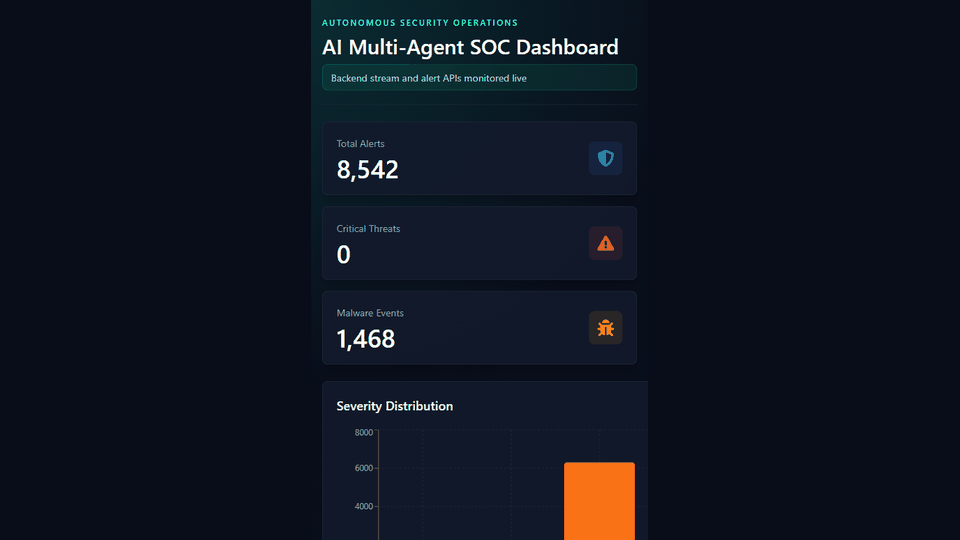

# AI Multi-Agent SOC(Security Operations Center) Dashboard


An end-to-end autonomous Security Operations Center built with real-time event streaming, AI-powered detection, multi-agent investigation, remediation workflows, and a polished live analyst dashboard.



## Why This Project Stands Out

This project simulates a modern AI-assisted SOC pipeline where multiple agents collaborate over Kafka to detect, enrich, investigate, remediate, and report security incidents in real time.

It is designed to demonstrate production-oriented engineering skills across distributed systems, ML integration, backend APIs, Dockerized infrastructure, and frontend observability.

## Core Capabilities

- Real-time security event pipeline using Kafka topics.
- FastAPI backend with REST endpoints and WebSocket streaming.
- PostgreSQL persistence for alert history and dashboard analytics.
- Redis pub/sub bridge for live SOC feed updates.
- Multi-agent workflow for detection, investigation, threat intelligence, remediation, and reporting.
- ML-based anomaly and intrusion detection components.
- LSTM-style sequence prediction surface for next-attack forecasting.
- React dashboard with live stats, severity chart, alert table, predictions, and threat feed.
- Fully Dockerized infrastructure for repeatable local runs.

## System Architecture

```text
Attack Simulator
      |
      v
Kafka: soc_logs
      |
      v
Detection Agent
      |
      v
Kafka: soc_alerts
      |
      +--> Investigation Agent
      |          |
      |          v
      |   Kafka: investigated_alerts
      |
      +--> Threat Intel Agent
      |          |
      |          v
      |   Kafka: threat_enriched_alerts
      |
      +--> Remediation Agent
                 |
                 v
          Kafka: remediation_actions
                 |
                 +--> PostgreSQL
                 +--> Redis pub/sub
                 +--> FastAPI WebSocket
                 +--> React Dashboard
```

## Tech Stack

| Layer | Tools |
| --- | --- |
| Frontend | React, Vite, Tailwind CSS, Recharts, Framer Motion |
| Backend | FastAPI, SQLAlchemy, WebSockets |
| Streaming | Apache Kafka, Zookeeper |
| Realtime | Redis pub/sub |
| Database | PostgreSQL |
| ML | scikit-learn, XGBoost, LightGBM, NumPy, Pandas |
| DevOps | Docker, Docker Compose |

## Repository Layout

```text
ai-multi-agent-soc/
├── agents/                 # Detection, investigation, intel, remediation, reporting agents
├── backend/                # FastAPI app, database models, alert routes, WebSocket stream
├── frontend/               # React SOC dashboard
├── kafka/                  # Kafka producer and consumer helpers
├── ml/                     # Training and sequence detection workflows
├── scripts/                # Attack simulator and operational scripts
├── docker-compose.yml      # Full local infrastructure
├── Dockerfile              # Backend and agent runtime image
└── README.md
```

## Quick Start

### 1. Clone and enter the repo

```bash
git clone https://github.com/ImmanuelP31/ai-multi-agent-soc.git
cd ai-multi-agent-soc
```

### 2. Start the SOC infrastructure

```bash
docker compose up -d --build
```

This starts PostgreSQL, Redis, Zookeeper, Kafka, the FastAPI backend, and all SOC agents.

Check service status:

```bash
docker compose ps
```

### 3. Verify the backend

```bash
curl http://127.0.0.1:8000/health
curl http://127.0.0.1:8000/alerts/stats
```

Backend URL:

```text
http://127.0.0.1:8000
```

### 4. Run the frontend dashboard

```bash
cd frontend
npm install
npm run dev
```

Open:

```text
http://127.0.0.1:5173
```

### 5. Generate simulated attacks

From the repo root:

```bash
python -m venv venv
source venv/bin/activate
pip install -r requirements.txt
python scripts/attack_simulator.py
```

On Windows PowerShell:

```powershell
python -m venv venv
.\venv\Scripts\activate
pip install -r requirements.txt
python scripts\attack_simulator.py
```

## Dashboard Features

- Total alert, critical threat, and malware counters.
- Severity distribution chart powered by backend analytics.
- Live security alert table backed by PostgreSQL.
- WebSocket-based threat feed powered by Redis pub/sub.
- AI attack prediction panel for sequence-model outputs.
- Responsive dark SOC interface built for quick analyst scanning.

## API Surface

| Endpoint | Purpose |
| --- | --- |
| `GET /` | Backend status message |
| `GET /health` | Backend and Redis health |
| `GET /alerts/` | Recent persisted SOC alerts |
| `GET /alerts/stats` | Dashboard counters and severity chart data |
| `WS /ws/live-alerts` | Live threat feed stream |

## Development Commands

Run frontend checks:

```bash
cd frontend
npm run lint
npm run build
```

Run backend syntax checks:

```bash
python -m py_compile backend/main.py backend/database.py backend/routes/alerts.py
```

Follow useful logs:

```bash
docker logs -f ai_soc_backend
docker logs -f ai_soc_detection
docker logs -f ai_soc_remediation
```

Stop everything:

```bash
docker compose down
```

## What This Demonstrates

- Building an event-driven system with multiple independently running workers.
- Designing a backend that serves both REST analytics and WebSocket updates.
- Persisting and repairing evolving database schema safely during local development.
- Connecting ML-driven detection outputs to a real-time analyst dashboard.
- Packaging a complex system into a repeatable Docker Compose workflow.
- Presenting technical work with a clean, recruiter-friendly frontend experience.

## Author

**Immanuel P**  
B.Tech Computer Science Engineering  
Focused on AI engineering, distributed systems, and cybersecurity automation.
