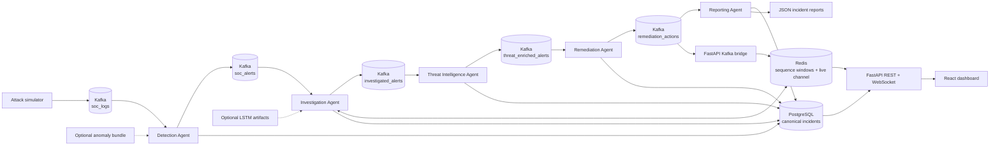

# AI Multi-Agent SOC

> Event-driven security operations pipeline for network-flow anomaly detection, per-source sequence correlation, structured MITRE ATT&CK enrichment, policy-gated remediation, and live incident analysis.

Five Kafka-backed workers progressively enrich a canonical security event without changing its identity. PostgreSQL stores one durable incident per event, Redis holds bounded sequence state and live-feed messages, and FastAPI supplies REST and WebSocket data to a React analyst dashboard. Trained ML artifacts are optional and their runtime availability is reported explicitly.


[](https://github.com/ImmanuelP31/ai-multi-agent-soc/actions/workflows/ci.yml)


_The dashboard combines persisted incident history with a Redis-backed live WebSocket feed._

## Contents

- [Why this project exists](#why-this-project-exists)
- [Architecture](#architecture)
- [Engineering properties](#engineering-properties)
- [ML pipeline](#ml-pipeline)
- [Reliability and replay safety](#reliability-and-replay-safety)
- [Security model](#security-model)
- [Quick start](#quick-start)
- [Configuration](#configuration)
- [API](#api)
- [Development and testing](#development-and-testing)
- [Repository structure](#repository-structure)
- [Current scope and limitations](#current-scope-and-limitations)
- [Design decisions](#design-decisions)

## Why this project exists

Security telemetry arrives continuously, while useful incident context emerges over time. A detector can flag a single flow, but investigation, ATT&CK mapping, response planning, durable storage, and analyst visibility have different state and failure requirements.

This repository separates those responsibilities into independently restartable Kafka consumers. It also addresses the less visible engineering problems behind the pipeline: stable event identity, training-serving feature parity, per-source sequence isolation, at-least-once delivery, idempotent persistence, and constrained remediation.

## Architecture


```mermaid
flowchart LR
    SIM["Attack simulator"] --> LOGS[("Kafka<br/>soc_logs")]
    LOGS --> DET["Detection Agent"]
    DET --> ALERTS[("Kafka<br/>soc_alerts")]
    ALERTS --> INV["Investigation Agent"]
    INV --> INVESTIGATED[("Kafka<br/>investigated_alerts")]
    INVESTIGATED --> INTEL["Threat Intelligence Agent"]
    INTEL --> ENRICHED[("Kafka<br/>threat_enriched_alerts")]
    ENRICHED --> REM["Remediation Agent"]
    REM --> ACTIONS[("Kafka<br/>remediation_actions")]
    ACTIONS --> REP["Reporting Agent"]

    BUNDLE["Optional anomaly bundle"] -.-> DET
    SEQ["Optional LSTM artifacts"] -.-> INV
    INV <--> REDIS[("Redis<br/>sequence windows + live channel")]

    DET --> PG[("PostgreSQL<br/>canonical incidents")]
    INV --> PG
    INTEL --> PG
    REM --> PG
    REP --> PG
    REP --> REPORTS["JSON incident reports"]

    ACTIONS --> BRIDGE["FastAPI Kafka bridge"]
    BRIDGE --> REDIS
    REDIS --> API["FastAPI REST + WebSocket"]
    PG --> API
    API --> UI["React dashboard"]
```

### Event lifecycle

1. The simulator creates a canonical event with one `event_id`, one `incident_id`, numeric flow telemetry, and isolated synthetic ground truth.
2. Detection validates telemetry and applies either the configured Isolation Forest bundle or the explicitly selected telemetry-rule mode.
3. Investigation appends the transformed flow to a Redis window scoped to the source IP, then uses the trained LSTM when a complete compatible artifact set is loaded.
4. Threat Intelligence normalizes observed and predicted labels and records a versioned ATT&CK technique, tactic, confidence, match type, evidence, and recommended action.
5. Remediation derives typed actions, validates targets, applies policy, and records dry-run results before publishing the enriched event.
6. Reporting uses the propagated incident identity to update a deterministic JSON report and the same PostgreSQL row.
7. FastAPI exposes historical state through REST and relays final enriched events from Kafka through Redis pub/sub to the dashboard WebSocket.

Each processing stage validates the Pydantic contract, upserts the incident, completes its required output, publishes downstream where applicable, and only then commits the Kafka offset.

## Engineering properties

| Capability | Implementation |
| --- | --- |
| Event transport | Five explicit Kafka topics with messages keyed by `source_ip`, falling back to `incident_id` |
| Event contract | Strict Pydantic `SOCEvent` schema with structured stage metadata and backward-compatible read projections |
| Delivery semantics | At-least-once Kafka processing with stable consumer groups and manual offset commits |
| Persistence | PostgreSQL and SQLAlchemy with an `event_id` uniqueness constraint and progressive upserts |
| Schema evolution | Alembic migrations; runtime services verify connectivity and do not mutate schemas ad hoc |
| Correlation state | Replay-safe, bounded Redis lists per source identity with a configurable TTL |
| Detection | Isolation Forest bundle with shared preprocessing, plus an explicit telemetry-rule demo mode |
| Sequence prediction | Leakage-aware LSTM pipeline and first-order Markov evaluation baseline |
| Threat mapping | Structured, versioned local MITRE ATT&CK mapping with auditable evidence |
| Remediation | Typed action plans behind a validation and policy boundary; shipped executor is dry-run only |
| API and UI | FastAPI REST/WebSocket backend and React dashboard with TanStack Query caching |
| Verification | Pytest unit and Compose integration tests, frontend tests, Ruff, ESLint, builds, and GitHub Actions |

## Technology stack

| Layer | Technology |
| --- | --- |
| Event streaming | Apache Kafka 3.7 with ZooKeeper |
| API | Python 3.11, FastAPI, WebSockets |
| Persistence | PostgreSQL 15, SQLAlchemy 2, Alembic |
| Ephemeral state | Redis 7 |
| ML | scikit-learn, TensorFlow/Keras, NumPy, Pandas |
| Frontend | React 19, Vite, Tailwind CSS, TanStack Query, Recharts, Framer Motion |
| Runtime | Multi-stage Docker images and Docker Compose |
| Testing | pytest, Vitest, Testing Library, GitHub Actions |

## ML pipeline

The repository keeps model training offline and validates artifacts before runtime use. Generated datasets and model files are intentionally excluded from version control.

### Anomaly detection

The training scripts expect CICIDS2017 network-flow CSV captures under `ml/datasets/`. [`ml/features/network_flow.py`](ml/features/network_flow.py) defines the ten canonical features and is imported by both training and runtime inference.

The complete `anomaly_bundle.joblib` contains:

- an Isolation Forest fitted on benign rows from the training split;
- a median imputer and standard scaler fitted only on that training population;
- the exact feature names and order;
- model, bundle, scikit-learn, and feature-pipeline versions;
- decision-function thresholds and their derivation.

Runtime inference reads only `telemetry.flow_features`. Event names and simulator ground-truth labels are not used to construct model inputs. `DETECTION_MODE=ml` fails startup if the bundle is absent or incompatible; the clean-clone default is the visibly reported `rule_based` demo mode.

Evaluation writes precision, recall, F1, a confusion matrix, false-positive rate, false-negative rate, and detection rate to `ml/models/anomaly_evaluation.json` when the dataset and bundle are available. No evaluation artifact is committed, so this README does not claim an anomaly benchmark.

### Sequence prediction

The LSTM predicts the next event class from sequences of five transformed network-flow observations. It uses the same feature contract as anomaly detection and excludes attack labels, severity, label frequency, and synthetic repeat-offender flags from `X`.

Source capture files are assigned to train, validation, and test groups before overlapping windows are built. Windows remain inside a source/session entity when the dataset exposes one; otherwise the source file is the documented chronological boundary. Imputation and scaling are fitted on training groups only and reused by validation, test, and runtime inference.

Training records accuracy, macro F1, weighted F1, top-3 accuracy, per-class precision/recall/F1, support, and a confusion matrix. A first-order Markov model is evaluated on the same held-out test groups. The versioned [`metadata.json`](ml/sequence_detection/metadata.json) currently has `status: requires_retraining` and contains no replacement metrics, so no LSTM score is presented here.

At runtime, Investigation uses one bounded Redis list per source identity and suppresses duplicate appends by `event_id`. `SEQUENCE_PREDICTION_MODE=required` fails when the model or preprocessor is unavailable. The default `optional` mode records the unavailable reason and does not substitute a rule-based next-attack prediction.

### Build model artifacts

Place the expected CICIDS2017 CSV files in `ml/datasets/`, then run the relevant workflow:

```bash
# Anomaly bundle
docker compose --profile training run --rm ml-training python ml/training/preprocess_dataset.py
docker compose --profile training run --rm ml-training python ml/training/create_splits.py
docker compose --profile training run --rm ml-training python ml/training/train_anomaly_model.py
docker compose --profile training run --rm ml-training python ml/training/evaluate_anomaly_model.py

# Sequence model, preprocessor, metadata, and evaluation
docker compose --profile training run --rm ml-training python ml/sequence_detection/generate_rich_sequences.py
docker compose --profile training run --rm ml-training python ml/sequence_detection/train_lstm_model.py
docker compose --profile training run --rm ml-training python scripts/evaluate_sequence_model.py
```

Artifact requirements and runtime behavior are documented in [`ml/models/README.md`](ml/models/README.md) and [`ml/sequence_detection/ARTIFACTS.md`](ml/sequence_detection/ARTIFACTS.md).

After generating artifacts, set `DETECTION_MODE=ml` and/or `SEQUENCE_PREDICTION_MODE=required` in `.env`, then rebuild the corresponding agent container so the artifacts are included in its image.

## Reliability and replay safety

Kafka delivery is treated as at-least-once. Application-level idempotency ensures a replayed event enriches the existing incident instead of creating a duplicate.

| Input topic | Consumer | Group ID | Output topic |
| --- | --- | --- | --- |
| `soc_logs` | Detection Agent | `soc-detection` | `soc_alerts` |
| `soc_alerts` | Investigation Agent | `soc-investigation` | `investigated_alerts` |
| `investigated_alerts` | Threat Intelligence Agent | `soc-threat-intel` | `threat_enriched_alerts` |
| `threat_enriched_alerts` | Remediation Agent | `soc-remediation` | `remediation_actions` |
| `remediation_actions` | Reporting Agent | `soc-reporting` | Final local report |
| `remediation_actions` | FastAPI live bridge | `soc-live-alert-bridge` | Redis `live_alerts` channel |

- Ingestion generates identity once. Downstream agents reject events missing the required IDs instead of regenerating them.
- Kafka auto-commit is disabled. Processing, persistence, local output, and downstream publication must succeed before the consumed offset advances.
- Processing failures are logged, the offset remains uncommitted, and the consumer seeks back to the failed message for retry.
- PostgreSQL locks and upserts by unique `event_id`; stage ordering prevents an older replay from rolling the incident stage backward.
- Remediation action IDs are deterministic from incident identity, action type, target type, and normalized target.
- Reporting writes `logs/reports/<incident_id>.json` and tracks processed incident IDs in its summary, making replay overwrite/update the same logical report.

The project intentionally has no dead-letter queue. A permanently malformed record remains a visible retry condition rather than being silently acknowledged.

## Security model

Remediation demonstrates response orchestration without mutating the host or an external security control.

- Supported actions are restricted to `BLOCK_IP`, `RATE_LIMIT_IP`, `ISOLATE_USER`, `FLAG_USER_FOR_REVIEW`, `INCREASE_MONITORING`, `AUDIT_LOG`, and `ESCALATE_TO_ANALYST`.
- IP targets pass through Python's `ipaddress` parser. Missing, unknown, malformed, loopback, link-local, unspecified, and multicast targets are non-actionable.
- User targets use a constrained identity character set.
- Command previews are typed argument arrays generated only after validation. The runtime does not call `subprocess`, interpolate untrusted shell strings, or use `shell=True`.
- Network-control and user-isolation actions are classified as requiring approval. Valid private addresses are retained for local simulation but cannot be executed by the shipped runtime.
- The only installed executor is `dry_run`; unsupported execution modes fail startup. No firewall, cloud, EDR, or identity-provider integration is enabled.

Severity is shared across the event contract, persistence, API, dashboard, and remediation. A HIGH event becomes CRITICAL only when deterministic corroborating threat evidence satisfies the rule in [`common/events.py`](common/events.py).

## Quick start

### Prerequisites

- Git
- Docker Engine or Docker Desktop
- Docker Compose v2 (`docker compose`)

Python and Node.js are only required for development outside containers.

### Configure

```bash
git clone https://github.com/ImmanuelP31/ai-multi-agent-soc.git
cd ai-multi-agent-soc
cp .env.example .env
```

On Windows PowerShell, use `Copy-Item .env.example .env`. The example is for local use; change the placeholder database password before using a shared environment.

### Start

```bash
docker compose up --build
```

This starts PostgreSQL, Redis, ZooKeeper, Kafka, deterministic topic initialization, Alembic migration, the backend, five agents, and the frontend. A clean clone starts in explicit rule-based detection mode and optional sequence mode because generated model artifacts are not committed.

### Verify

```bash
docker compose ps
curl http://localhost:8000/health/live
curl http://localhost:8000/health
```

- Dashboard: [http://localhost:5173](http://localhost:5173)
- API documentation: [http://localhost:8000/docs](http://localhost:8000/docs)

`/health/live` reports process liveness. `/health` returns readiness for PostgreSQL, Redis, Kafka topics, all pipeline agents, and configured model modes.

### Generate traffic

In another terminal:

```bash
docker compose exec backend python scripts/attack_simulator.py
```

The simulator emits one synthetic network-flow event every two seconds until stopped. Only backend and frontend ports are exposed by default. Use `docker-compose.dev.yml` when direct host access to infrastructure is needed:

```bash
docker compose -f docker-compose.yml -f docker-compose.dev.yml up --build
```

Stop the stack with `docker compose down`.

## Configuration

The checked-in [`.env.example`](.env.example) contains local defaults and no operational secret. Compose builds `DATABASE_URL` from the PostgreSQL values below.

| Variable | Purpose | Compose default |
| --- | --- | --- |
| `POSTGRES_USER` | PostgreSQL role | `socuser` |
| `POSTGRES_PASSWORD` | PostgreSQL password | Local placeholder; change it |
| `POSTGRES_DB` | Incident database | `socdb` |
| `DATABASE_URL` | Direct Python/Alembic database connection | Constructed by Compose |
| `KAFKA_BOOTSTRAP_SERVERS` | Kafka broker list | `kafka:9092` |
| `REDIS_HOST`, `REDIS_PORT` | Redis connection | `redis`, `6379` |
| `CORS_ALLOWED_ORIGINS` | Comma-separated credentialed CORS allowlist | Local frontend origins |
| `BACKEND_PORT`, `FRONTEND_PORT` | Published host ports | `8000`, `5173` |
| `VITE_API_URL`, `VITE_WS_URL` | Frontend REST and WebSocket endpoints | Local backend URLs |
| `DETECTION_MODE` | `rule_based` or required `ml` detection | `rule_based` |
| `ANOMALY_MODEL_BUNDLE` | Isolation Forest bundle path | `/app/ml/models/anomaly_bundle.joblib` |
| `SEQUENCE_PREDICTION_MODE` | `optional` or `required` LSTM loading | `optional` |
| `SEQUENCE_ARTIFACT_DIR` | Sequence model and preprocessor directory | `/app/ml/sequence_detection` |
| `SEQUENCE_STATE_TTL_SECONDS` | Per-source Redis window TTL | `3600` |
| `REMEDIATION_EXECUTION_MODE` | Remediation executor selection | `dry_run` only |
| `REMEDIATION_ALLOW_DESTRUCTIVE` | Policy gate reserved for non-dry-run executors | `false` |

## API

| Method | Endpoint | Description |
| --- | --- | --- |
| `GET` | `/` | Basic backend status |
| `GET` | `/health/live` | Process liveness |
| `GET` | `/health` | Infrastructure, agent, topic, and model-mode readiness |
| `GET` | `/alerts/` | Paginated recent logical incidents (`limit` up to 500, plus `skip`) |
| `GET` | `/alerts/stats` | Incident counts and severity distribution |
| `WS` | `/ws/live-alerts` | Final enriched events relayed through Redis pub/sub |

FastAPI's interactive OpenAPI interface is available at `/docs`.

## Development and testing

### Python checks

```bash
python -m pip install -r requirements-dev.txt
ruff check .
python -m compileall -q agents backend common ml scripts tests
python -m pytest -m "not integration" --cov
```

### Frontend checks

```bash
cd frontend
npm ci
npm test
npm run lint
npm run build
```

### Database migrations

```bash
docker compose run --rm migrate
```

For a local Python environment with `DATABASE_URL` set:

```bash
alembic upgrade head
alembic current
```

### Compose integration test

The smoke test injects a deterministic event, waits for final reporting, replays the same event, and verifies one incident, stable enrichment, deterministic actions, and one report.

```bash
docker compose -p ai-soc-integration --env-file .env.test -f docker-compose.yml -f docker-compose.test.yml up -d --build
docker compose -p ai-soc-integration --env-file .env.test -f docker-compose.yml -f docker-compose.test.yml --profile test run --rm integration-test
docker compose -p ai-soc-integration --env-file .env.test -f docker-compose.yml -f docker-compose.test.yml down -v
```

The GitHub Actions workflow runs Python linting, compilation, unit tests with coverage, frontend audit/tests/lint/build, and the Compose replay smoke test.

### Testing strategy

- Domain and processor unit tests run without Kafka infinite loops.
- Contract tests cover validation, identity preservation, serialization, timestamps, and feature order.
- ML tests cover deterministic preprocessing, artifact validation, missing values, missing models, grouped sequence construction, and Redis state isolation.
- Failure-path tests cover malformed Kafka messages, publish and persistence failures, Redis outages, and invalid model output without premature acknowledgement.
- Persistence and reporting tests cover progressive enrichment and duplicate replay.
- Frontend tests cover shared query caching, loading/error states, WebSocket invalidation, normalized API data, and sequence rendering.
- The Compose integration test exercises the complete pipeline against Kafka, Redis, and PostgreSQL.

## Repository structure

```text
.
|-- agents/                  # Kafka worker entry points and testable processors
|-- common/                  # Event, Kafka, health, label, and remediation contracts
|-- backend/                 # FastAPI application, ORM model, REST, and WebSocket bridge
|-- frontend/                # React analyst dashboard and frontend tests
|-- ml/
|   |-- features/            # Shared training/runtime network-flow preprocessing
|   |-- models/              # Generated anomaly artifacts (not committed)
|   |-- sequence_detection/  # Grouped sequence pipeline, predictor, and metadata
|   `-- training/            # Offline anomaly preprocessing, training, and evaluation
|-- alembic/                 # Versioned incident schema migrations
|-- kafka/                   # Canonical local producer and observer utilities
|-- scripts/                 # Traffic simulator and sequence evaluation entry point
|-- tests/                   # Unit, persistence, ML, failure-path, and integration tests
|-- .github/workflows/       # Continuous integration
|-- docker-compose.yml       # Default local stack
|-- docker-compose.dev.yml   # Optional infrastructure port exposure
|-- docker-compose.test.yml  # Integration test service overrides
`-- Dockerfile               # Runtime, sequence, test, and training image targets
```

## Current scope and limitations

- Telemetry is generated by the included simulator or prepared from local CICIDS2017 files; no live sensor, packet capture, SIEM, or EDR integration is included.
- Generated model and evaluation artifacts are not committed. A clean clone uses explicit rule-based anomaly detection and reports the LSTM as unavailable until trained artifacts are supplied.
- The committed sequence metadata requires retraining and does not contain a valid replacement benchmark.
- The simulator keeps its synthetic attack label under `ground_truth`. In the default rule-based and model-unavailable configuration, ATT&CK enrichment can remain `unknown` because downstream processors correctly avoid using that hidden label as observed evidence.
- ATT&CK enrichment uses a small repository-local mapping (`2026-09-project-v1`), not a live CTI feed or an official ATT&CK release dataset.
- Remediation is dry-run only. It does not alter firewall, host, cloud, or identity state.
- Docker Compose is a local, single-node topology with plaintext Kafka and one partition per topic; it is not a high-availability deployment.
- The API and dashboard do not implement authentication or authorization and are intended for a trusted local environment.
- Failed Kafka records retry in place; no dead-letter queue or operator workflow is included.
- Reports and summaries are local JSON files in a Docker volume rather than a distributed report store.
- The repository currently has no `LICENSE` file, so redistribution terms are not defined.

These boundaries keep the repository focused on event contracts, processing semantics, ML lifecycle discipline, and safe orchestration rather than claiming a deployable replacement for an enterprise SOC platform.

## Design decisions

**Kafka instead of synchronous agent chaining.** Each stage owns a stable consumer group and can restart independently while Kafka provides buffering between processors.

**At-least-once delivery plus application idempotency.** The pipeline does not claim exactly-once transport. Stable IDs, deterministic outputs, manual commits, and database upserts make normal replay safe.

**Redis only for ephemeral coordination.** Redis stores bounded per-source sequence windows and the transient live-feed channel; PostgreSQL remains the authoritative incident store.

**Shared preprocessing artifacts.** Detection and sequence runtime code load the same feature order, fitted imputation, and scaling state created by training, preventing training-serving skew.

**Dry-run remediation by default and by implementation.** Typed actions demonstrate policy-aware response planning without exposing the host to commands derived from untrusted event data.

## Author

**Immanuel P**
