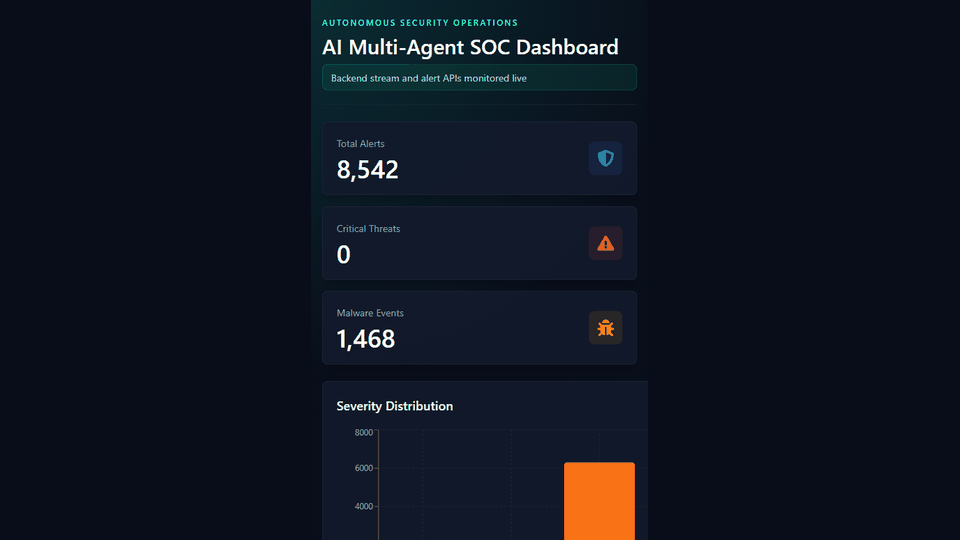

# AI Multi-Agent SOC (Security Operations Center) Dashboard


An end-to-end autonomous Security Operations Center built with real-time event streaming, AI-powered detection, multi-agent investigation, remediation workflows, and a polished live analyst dashboard.



## Why This Project Stands Out

This project simulates a modern AI-assisted SOC pipeline where multiple agents collaborate over Kafka to detect, enrich, investigate, remediate, and report security incidents in real time.

It is designed to demonstrate production-oriented engineering skills across distributed systems, ML integration, backend APIs, Dockerized infrastructure, and frontend observability.

## Core Capabilities

- Real-time security event pipeline using Kafka topics.
- FastAPI backend with REST endpoints and WebSocket streaming.
- PostgreSQL persistence for alert history and dashboard analytics.
- Redis pub/sub bridge for live SOC feed updates.
- Multi-agent workflow for detection, investigation, threat intelligence, remediation, and reporting.
- Isolation Forest anomaly detection with an explicit telemetry-rule demo mode.
- Leakage-free LSTM sequence prediction when trained artifacts are supplied.
- React dashboard with live stats, severity chart, alert table, predictions, and threat feed.
- Fully Dockerized infrastructure for repeatable local runs.

## System Architecture

```text
Attack Simulator
      |
      v
Kafka: soc_logs (keyed by source_ip)
      |
      v
Detection Agent
      |
      v
Kafka: soc_alerts
      |
      v
Investigation Agent -> Redis sequence window -> Kafka: investigated_alerts
      |
      v
Threat Intel Agent -> Kafka: threat_enriched_alerts
      |
      v
Remediation Agent -> Kafka: remediation_actions
      |
      +--> Reporting Agent
      +--> PostgreSQL (one progressively enriched row)
      +--> Redis pub/sub -> FastAPI WebSocket -> React Dashboard
```

Every message uses the canonical Pydantic contract in `common/events.py`.
The simulator creates `event_id` and `incident_id` once; every downstream
agent validates and preserves both values. Messages are keyed by `source_ip`
(falling back to `incident_id`) and each agent uses its own stable consumer
group with manual offset commits. An offset is committed only after the
database upsert, required local output, and downstream Kafka publication
succeed.

PostgreSQL enforces a unique index on `event_id`. Detection, investigation,
threat intelligence, remediation, and reporting update that same incident row
with nested metadata and the current processing stage, so Kafka retries enrich
the existing incident instead of inserting duplicates.

The active topic chain is `soc_logs` (`soc-detection`), `soc_alerts`
(`soc-investigation`), `investigated_alerts` (`soc-threat-intel`),
`threat_enriched_alerts` (`soc-remediation`), and `remediation_actions`
(`soc-reporting`). Sequence prediction exists only inside Investigation; there
is no second sequence consumer or parallel prediction topic.

## Tech Stack

| Layer | Tools |
| --- | --- |
| Frontend | React, Vite, Tailwind CSS, Recharts, Framer Motion |
| Backend | FastAPI, SQLAlchemy, WebSockets |
| Streaming | Apache Kafka, Zookeeper |
| Realtime | Redis pub/sub and durable sequence windows |
| Database | PostgreSQL |
| ML | scikit-learn, TensorFlow, NumPy, Pandas |
| DevOps | Docker, Docker Compose |

## Repository Layout

```text
ai-multi-agent-soc/
├── agents/                 # Detection, investigation, intel, remediation, reporting agents
├── alembic/                # Versioned PostgreSQL schema migrations
├── backend/                # FastAPI app, canonical incident model, API and WebSocket stream
├── common/                 # Canonical event contract and replay-safe Kafka helpers
├── frontend/               # React SOC dashboard
├── kafka/                  # Kafka producer and consumer helpers
├── ml/                     # Training and sequence detection workflows
├── scripts/                # Attack simulator and operational scripts
├── docker-compose.yml      # Full local infrastructure
├── docker-compose.dev.yml  # Optional host ports for infrastructure debugging
├── Dockerfile              # Runtime, sequence, test, and training targets
└── README.md
```

## Quick Start

### 1. Clone and enter the repo

```bash
git clone https://github.com/ImmanuelP31/ai-multi-agent-soc.git
cd ai-multi-agent-soc
cp .env.example .env
```

On Windows PowerShell, use `Copy-Item .env.example .env`. The example contains
local-only values; choose a different URL-safe database password for any shared
environment.

### 2. Start the SOC infrastructure

```bash
docker compose up -d --build
```

This starts PostgreSQL, Redis, ZooKeeper, Kafka, migrations, the backend, all
five agents, and the frontend. A clean clone uses the visible `rule_based`
detection demo mode and `optional` sequence mode. Trained ML modes are enabled
explicitly only after their complete artifacts are generated.

Check service status:

```bash
docker compose ps
```

### 3. Verify the backend

```bash
curl http://127.0.0.1:8000/health/live
curl http://127.0.0.1:8000/health
curl http://127.0.0.1:8000/alerts/stats
```

`/health/live` proves the API process is running. `/health` returns ready only
when PostgreSQL, Redis, Kafka, every required topic, and every agent are ready;
agent entries include the configured ML mode and actual model load status.

Backend and frontend URLs:

```text
http://127.0.0.1:8000
http://127.0.0.1:5173
```

### 4. Generate simulated attacks

From the repo root:

```bash
docker compose exec backend python scripts/attack_simulator.py
```

Only backend and frontend ports are published by default. To expose PostgreSQL,
Redis, ZooKeeper, and Kafka for local debugging, opt in explicitly:

```bash
docker compose -f docker-compose.yml -f docker-compose.dev.yml up -d --build
```

## Anomaly Detection Bundle

The Isolation Forest uses one shared feature pipeline in
`ml/features/network_flow.py`. Training and runtime inference use the same ten
ordered network-flow fields, fitted median imputer, and fitted scaler. The
detector reads only numeric `telemetry.flow_features`; simulator attack labels
remain under `ground_truth` and are never model inputs.

Train and evaluate the complete bundle:

```bash
docker compose --profile training run --rm ml-training python ml/training/train_anomaly_model.py
docker compose --profile training run --rm ml-training python ml/training/evaluate_anomaly_model.py
```

Training writes `ml/models/anomaly_bundle.joblib`, containing the model,
imputer, scaler, feature order, version metadata, and decision-function
thresholds. Evaluation writes `ml/models/anomaly_evaluation.json` with
precision, recall, F1, confusion matrix, false-positive rate, false-negative
rate, and detection rate.

Generated artifacts are ignored by Git but included in Docker build contexts.
After training, set `DETECTION_MODE=ml` in `.env` and run
`docker compose up -d --build detection-agent`. ML mode fails clearly when the
bundle is missing or incompatible. The clean-clone `rule_based` mode reports
`detection_method: rule_based_fallback` and `model_status: explicit_fallback`.
The obsolete standalone model/scaler/feature `.pkl` files were removed because
the runtime accepts only the validated all-in-one bundle.

## LSTM Prediction Notes

The sequence experiment uses the same ten numeric CICIDS flow fields at
training and runtime. Attack labels, severity, label frequency, and synthetic
repeat-offender flags are not model inputs. Labels are used only as the next
event target and as historical context for the comparison-only Markov baseline.

Source CSV files are assigned to train, validation, or test before sliding
windows are created. Within each file, windows are built separately for a real
source/session column when available; otherwise the source file is the explicit
chronological boundary. No window crosses an entity or split boundary, and the
imputer and scaler are fitted on training groups only.

The previous 85.07% result is invalidated because it used label-derived
features and randomly split overlapping windows. A replacement score is only
recorded after evaluation on untouched source groups. Evaluation includes
accuracy, macro and weighted F1, top-3 accuracy, per-class metrics/support, and
a confusion matrix for both the LSTM and first-order Markov baseline.

To enable the real LSTM path:

```bash
docker compose --profile training run --rm ml-training python ml/sequence_detection/generate_rich_sequences.py
docker compose --profile training run --rm ml-training python ml/sequence_detection/train_lstm_model.py
docker compose --profile training run --rm ml-training python scripts/evaluate_sequence_model.py
```

Training writes `sequence_dataset.npz`, `sequence_preprocessor.joblib`,
`sequence_model.keras`, and machine-readable `sequence_evaluation.json` beside
the versioned metadata. Set `SEQUENCE_PREDICTION_MODE=required` in `.env`, then
run `docker compose up -d --build investigation-agent`. Required mode exits
unless TensorFlow loads the complete compatible artifact set. Default
`optional` mode keeps the unavailable reason visible in event metadata and
readiness output and never substitutes a rule prediction. With a loaded model,
predictions begin after five telemetry events from the same source.

At runtime, Investigation stores each source identity in a separate bounded
Redis list named `soc:sequence:<source-ip>`. Lists retain at most the configured
sequence length and default to a one-hour TTL. State therefore survives agent
restarts without allowing two source IPs to share a window. Redis failure stops
processing and leaves the Kafka offset uncommitted for retry; it never falls
back to an incomplete in-memory sequence. Successful predictions persist the
top classes, primary confidence, sequence length, model version, and prediction
timestamp in the alert's investigation metadata.

## Remediation Safety Model

Remediation remains simulation-only. Canonical schema `1.1` accepts only
the typed actions `BLOCK_IP`, `RATE_LIMIT_IP`, `ISOLATE_USER`,
`FLAG_USER_FOR_REVIEW`, `INCREASE_MONITORING`, `AUDIT_LOG`, and
`ESCALATE_TO_ANALYST`. Each action has a deterministic ID derived from the
incident, action type, target type, and normalized target, so replaying an event
does not create a second logical response.

IP targets are parsed with Python's `ipaddress` module before an action or argv
preview is created. Missing, `unknown`, malformed, loopback, link-local,
unspecified, and multicast addresses are never used for network-control
actions. Valid private addresses are retained for realistic local demos, but
only as dry-run targets; they receive the same approval classification as
public addresses. User targets allow only a constrained identity character set.

`BLOCK_IP`, `RATE_LIMIT_IP`, and `ISOLATE_USER` require approval for any
non-dry-run executor. All other actions are automatic-safe. The repository ships
only the `dry_run` executor, never invokes `shell=True` or `subprocess`, and
stores display-only command previews as argument lists. Unsupported execution
modes fail startup. `REMEDIATION_ALLOW_DESTRUCTIVE=false` remains the safe
default for future executor implementations.

Severity uses the shared `Severity` enum throughout detection, persistence,
remediation, API statistics, and the dashboard. HIGH becomes CRITICAL only
after an exact MITRE match with confidence of at least 0.90 corroborates an
Impact or Privilege Escalation tactic, or after at least ten observed failed
logins corroborate Credential Access. Fuzzy or predicted labels cannot trigger
the promotion.

## Dashboard Features

- Total alert, critical threat, and malware counters.
- Severity distribution chart powered by backend analytics.
- Live security alert table backed by PostgreSQL.
- WebSocket-based threat feed powered by Redis pub/sub.
- AI attack prediction panel for sequence-model outputs.
- Responsive dark SOC interface built for quick analyst scanning.

## API Surface

| Endpoint | Purpose |
| --- | --- |
| `GET /` | Backend status message |
| `GET /health/live` | Backend process liveness |
| `GET /health` | Dependency, topic, agent, and model readiness |
| `GET /alerts/` | Recent persisted SOC alerts |
| `GET /alerts/stats` | Dashboard counters and severity chart data |
| `WS /ws/live-alerts` | Live threat feed stream |

## Development Commands

Pinned Python dependencies are separated by purpose:

- `requirements-runtime.txt`: backend, Kafka agents, Redis, and anomaly runtime.
- `requirements-sequence.txt`: runtime plus TensorFlow for Investigation.
- `requirements-training.txt`: sequence dependencies plus Parquet support.
- `requirements-dev.txt`: runtime plus Ruff, pytest, and coverage.

Unused LightGBM, XGBoost, YARA, Capstone, Prometheus, HTTP clients, and frontend
packages were removed because no current code path imports them.

Apply database migrations without starting the full stack:

```bash
docker compose run --rm migrate
```

For a local Python environment with `DATABASE_URL` configured, the equivalent
commands are:

```bash
alembic upgrade head
alembic current
```

Create schema changes as new Alembic revisions. Runtime services only verify
database connectivity; they do not call `create_all()` or repair tables with
ad-hoc `ALTER TABLE` statements.

Run frontend checks:

```bash
cd frontend
npm run lint
npm run build
```

Run backend syntax checks:

```bash
python -m py_compile backend/main.py backend/database.py backend/routes/alerts.py
```

Run pipeline unit tests:

```bash
pip install -r requirements-dev.txt
ruff check .
python -m pytest -m "not integration" --cov
```

Run the replay smoke test in an isolated Docker Compose stack:

```bash
docker compose -p ai-soc-step7 --env-file .env.test -f docker-compose.yml -f docker-compose.test.yml up -d --build
docker compose -p ai-soc-step7 --env-file .env.test -f docker-compose.yml -f docker-compose.test.yml --profile test run --rm integration-test
docker compose -p ai-soc-step7 --env-file .env.test -f docker-compose.yml -f docker-compose.test.yml down -v
```

Follow useful logs:

```bash
docker compose logs -f backend detection-agent remediation-agent
```

Stop everything:

```bash
docker compose down
```

## What This Demonstrates

- Building an event-driven system with multiple independently running workers.
- Designing a backend that serves both REST analytics and WebSocket updates.
- Evolving a replay-safe PostgreSQL incident schema through versioned Alembic migrations.
- Connecting ML-driven detection outputs to a real-time analyst dashboard.
- Packaging a complex system into a repeatable Docker Compose workflow.
- Presenting technical work with a clean, recruiter-friendly frontend experience.

## Author

**Immanuel P**  
B.Tech Computer Science Engineering  
Focused on AI engineering, distributed systems, and cybersecurity automation.
